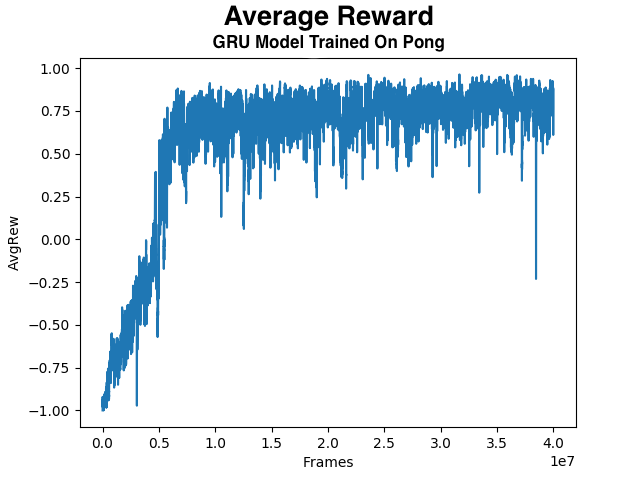
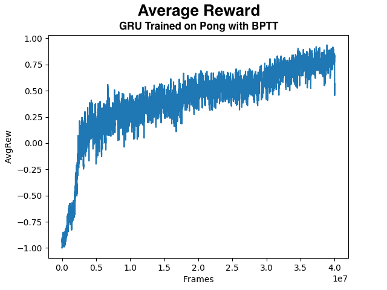

# A2C

## Description
This is an implementation of [A2C](https://blog.openai.com/baselines-acktr-a2c/) written in PyTorch using OpenAI gym environments.

This implementation includes options for a convolutional model, the original A3C model, a fully connected model (based off Karpathy's Blog), and a GRU based recurrent model. 

#### BPTT
The recurrent training can optionally use backpropagation through time (BPTT) which builds gradient dependencies over a sequence of states rather than the simply the current state. Preliminary results indicate that using BPTT does not improve training performance. See [Performance](#Performance) for a comparison of the two training approaches.

## <a name="Performance">Performance</a>
The algorithm was trained on Pong-v0. The reward graphs are of the moving average of the reward collected during rollouts for training.

For Pong, the reward metric is a running average of the reward collected at the end of each game rather than the full 21 point match. This makes the minimum reward -1 and the maximum +1. The moving average factor was set at 0.99.

------------------

Plot of the average reward during the training of a GRU model on Pong-v0 over the course of 40 million time steps.

------------------

Plot of the average reward during the training of a GRU model on Pong-v0 trained using Backprop Through Time over the course of 40 million time steps.

------------------

## Dependencies
- python 3.5 or later
- gym
- [gym-snake](https://github.com/grantsrb/Gym-Snake)
- numpy
- matplotlib
- pytorch 0.4.0

## How to Use this Repo
### Jumping In
You probably know how to clone a repo if you're getting into RL. But in case you don't, open a bash terminal and type the command:

    $ git clone https://github.com/grantsrb/PyTorch-A2C

Then navigate to the top folder using

    $ cd PyTorch-A2C

Hopefully you have already installed all the appropriate dependencies. See the section called **Dependencies** for a list of required dependencies.

To run a session on gym's Pong-v0 use the command:

    $ python main.py env_type=Pong-v0

This will run a training session with the hyperparameters listed in the `hyperparams.py` where `env_type` is set equal to Pong-v0.

### Watching Your Trained Policy
After training your policy, you can watch the policy run in the environment using the `watch_model.py` script. To use this file, pass the name of the saved PyTorch Module state dict that you would like to watch. You will also like to specify the environment type and model type by setting the default `hyperparams` in `hyperparams.py` or by specifying at the command line using: `env_type=<name_of_gym_environment>` and `model_type=<model_type>` respectively.

Here's an example:

    $ python watch_model.py save_file=default_net.p env_type=Pong-v0 model_type=conv

The order of the command line arguments does not matter.

### Automated Hyper Parameter Search
Much of deep learning consists of tuning hyperparameters. It can be extremely addicting to change the hyperparameters by hand and then stare at the average reward as the algorithm trains. THIS IS A HOMERIAN SIREN! DO NOT SUCCUMB TO THE PLEASURE! It is too easy to change hyperparameters before their results are fully known. It is difficult to keep track of what you did, and the time spend toying with hyperparameters can be spent reading papers, studying something useful, or calling your Mom and telling her that you love her (you should do that more often btw. And your dad, too.)

This repo contains an automated system under the name `hypersearch.py`. 

You can set the ranges of the hyperparameters you would like to search over manually, or use the function: `make_hyper_range` located in the `hyperparams.py` file. See `hypersearch.py` for an example.

### Command Line Arguments
RL algorithms often need to be tuned well for them to work. There are tons of hyperparameters that can have large impacts on the training of the algorithm. In order to help with automated hyperparameter tuning, this project offers a number of optional command line arguments. Each is set using `<argument_name>=<argument>` with no spaces. For example, if you wanted to set the variable `n_envs` (the number of parallel environments) to 15, then you would use the following:

    $ python train_model.py n_envs=15

#### List of Command Line Arguments
See `hyperparams.py` to access the default values.

##### String Hyperparameters
* `exp_name` - string of the name of the experiment. Determines the name that the PyTorch state dicts are saved to.
* `model_type` - Denotes the model architecture to be used in training. Options include 'fc', 'conv', 'a3c', 'gru'
* `env_type` - string of the type of environment you would like to use A2C on. The environment must be an OpenAI gym environment.
* `optim_type` - Denotes the type of optimizer to be used in training. Options: rmsprop, adam

##### Integer Hyperparameters
* `max_tsteps` - Maximum number of time steps to collect over course of training
* `n_tsteps` - integer number of steps to perform in each environment per rollout.
* `n_envs` - integer number of parallel processes to instantiate and use for training.
* `n_frame_stack` - integer number denoting number of observations to stack to be used as the environment state.
* `n_rollouts` - integer number of rollouts to collect per gradient descent update. Whereas `n_envs` specifies the number of parallel processes, `n_rollouts` indicates how many rollouts should be performed in total amongst these processes. 
* `n_past_rews` - number of past epochs to keep statistics from. Only affects logging and statistics printing, no effect on actual training.

##### Float Hyperparameters
* `lr` - learning rate
* `lr_low` - if `decay_lr` is set to true, this value denotes the lower limit of the `lr` decay.
* `lambda_` - float value of the generalized advantage estimation moving average factor. Only applies if using GAE.
* `gamma` - float value of the discount factor used to discount the rewards and advantages.
* `gamma_high` - if `incr_gamma` is set to true, this value denotes the upper limit of the `gamma` increase.
* `val_coef` - float value determining weight of the value loss in the total loss calculation
* `entr_coef` - float value determining weight of the entropy in the total loss calculation
* `entr_coef_low` - if `decay_entr` is set to true, this value denotes the lower limit of the `entr_coef` coeficient decay.
* `max_norm` - denotes the maximum gradient norm for gradient norm clipping

##### Boolean Hyperparameters
* `resume` - boolean denoting whether the training should be resumed from a previous point.
* `render` - boolean denoting whether the gym environment should be rendered
* `decay_lr` - if set to true, `lr` is linearly decreased from `lr`'s initial value to the lower limit set by `lr_low` over the course of the entire run.
* `decay_entr` - if set to true, `entr_coef` is linearly decreased from `entr_coef`'s initial value to the lower limit set by `entr_coef_low` over the course of the entire run.
* `use_nstep_rets` - if set to true, uses [n-step returns](https://arxiv.org/abs/1705.07445) method for value loss as opposed to empirical discounted rewards.
* `norm_advs` - if set to true, normalizes advantages over entire dataset. Takes precedence over `norm_batch_advs`.
* `use_bnorm` - uses batch normalization in model if set to true
* `use_bptt` - uses backprop through time if using recurrent model and set to true

##### Specific to snake-v0
* `grid_size` - integer denoting square dimensions for size of grid for snake.
* `n_foods` - integer denoting number of food pieces to appear on grid
* `unit_size` - integer denoting number of pixels per unit in grid.

